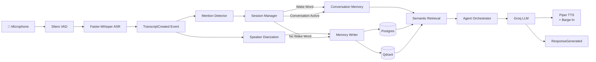
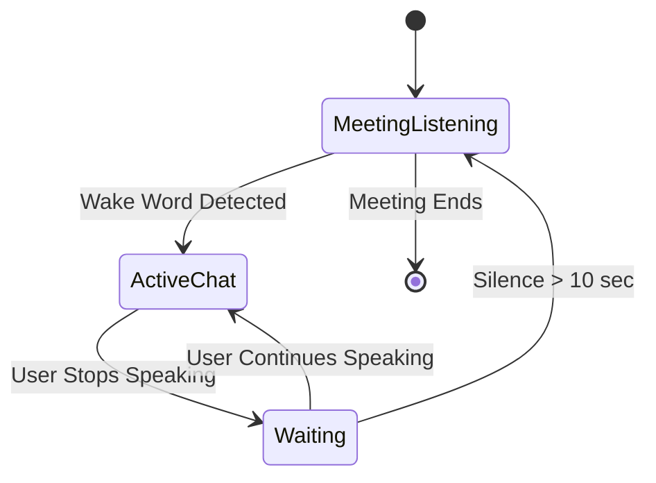

# AI Meeting Representative Architecture

This voice agent now runs as an always-listening meeting representative.

The local microphone is still the entry point: `audio_io.MicListener` captures speech with VAD gating, `asr.FasterWhisperASR` transcribes each completed utterance, and `main.py` publishes a `TranscriptCreated` event to NATS JetStream.

From there, choreography happens through the event bus. A transcript consumer always writes every utterance to Postgres and Qdrant, then checks `mention_detector.is_mention()`. If the utterance is not addressed to the agent, the pipeline stops there and the agent stays silent.

When a mention is detected, the **Session Manager** determines whether to start a new conversation session or continue an existing one. Once a session is active, every subsequent utterance is automatically routed through retrieval until the session times out. `retrieval.retrieve_context()` gathers relevant meeting history from Qdrant together with structured records from Postgres. The grounded context is passed to Groq through `llm.GroqLLM`, and the generated answer is spoken by Piper through `tts.PiperTTS` with the existing barge-in interrupt watcher still active during playback.

---

# Event Flow



---

# System States



---

# Runtime Event Flow

```text
                           Continuous Microphone
                                    │
                                    ▼
                               Silero VAD
                                    │
                                    ▼
                         Streaming Audio Buffer
                                    │
                   ┌────────────────┴────────────────┐
                   │                                 │
                   ▼                                 ▼
           Audio Segmenter (5–10 s)         Continue Recording
                   │                                 │
                   ▼                                 │
        Faster-Whisper ASR Worker                   │
                   │                                 │
                   ▼                                 │
        Partial Transcript Buffer ◄──────────────────┘
                   │
                   ▼
          TranscriptCreated Event
                   │
          ┌────────┴──────────────────────────────┐
          │                                       │
          ▼                                       ▼
  Meeting Pipeline                     Conversation Pipeline
          │                                       │
          ▼                                       ▼
 Speaker Diarization                    Mention Detector
          │                                       │
          ▼                                       ▼
    Memory Writer                       Session Manager
          │                                       │
     ┌────┴────┐                         ┌────────┴──────────┐
     ▼         ▼                         │                   │
 Postgres   Qdrant              Meeting Listening    Active Chat
                                                   │
                                                   ▼
                                          Conversation Memory
                                                   │
                                                   ▼
                                          Semantic Retrieval
                                                   │
                                                   ▼
                                          Agent Orchestrator
                                                   │
                                                   ▼
                                               Groq LLM
                                                   │
                                                   ▼
                                                Piper TTS
                                                   │
                                                   ▼
                                           Conversation Ends
```
---

# Streaming Speech Recognition

To minimize transcription latency during long utterances, the Meeting Pipeline
uses incremental speech recognition instead of waiting for the user to finish
speaking.

Rather than recording an entire 20–30 second utterance before invoking ASR,
audio is continuously captured and divided into small speech segments
(typically 5–10 seconds).

The microphone never stops recording while the ASR worker is transcribing a
previous segment.

Each completed segment is transcribed independently and appended to the current
transcript. When the user finally finishes speaking, most of the transcription
has already been completed, significantly reducing end-to-end latency.

```text
                     Continuous Microphone
                              │
                              ▼
                        Silero VAD
                              │
                              ▼
                    Streaming Audio Buffer
                              │
                 ┌────────────┴────────────┐
                 │                         │
                 ▼                         ▼
         Audio Segmenter             Continue Recording
           (5–10 seconds)                   │
                 │                          │
                 ▼                          │
        Faster-Whisper Worker              │
                 │                          │
                 ▼                          │
        Partial Transcript Buffer ◄─────────┘
                 │
                 ▼
        TranscriptCreated Event
```
---

### Advantages

- Continuous microphone capture with no recording gaps.
- Incremental transcription every 5–10 seconds.
- Significantly lower perceived latency for long utterances.
- Prevents very long audio segments from reaching Whisper.
- Naturally scales to live meeting transcription.
- Compatible with the existing NATS event-driven architecture.
- No changes are required to the downstream Meeting Pipeline or Conversation Pipeline.

---

# Session Manager

The Session Manager owns the conversation lifecycle.

The Mention Detector is responsible only for detecting wake words.

```text
                    +----------------------+
                    |  Meeting Listening   |
                    +----------------------+
                               |
                        Wake Word?
                          /     \
                        No       Yes
                        |         |
            Store Transcript      |
            Update Memory         |
            Ignore                |
                                  ▼
                     +-----------------------+
                     |   Active Chat Session |
                     +-----------------------+
                                  |
                       Every Transcript
                                  |
                  Update Conversation Memory
                                  |
                     Semantic Retrieval
                                  |
                     Agent Orchestrator
                                  |
                             Groq LLM
                                  |
                             Piper TTS
                                  |
                      Reset Idle Timer
                                  |
                       User Pauses Speaking
                                  |
                                  ▼
                        +------------------+
                        |     Waiting      |
                        +------------------+
                                  |
                   Continue Talking? / 10 sec Silence
                         /                  \
                       Yes                  No
                        |                   |
                        ▼                   ▼
              Active Chat Session   Meeting Listening
```

---

# Responsibilities

## 1. Meeting Pipeline (Always Running)

Responsible for building meeting intelligence.

Components:

* Silero VAD
* Faster-Whisper
* Speaker Diarization
* Memory Writer
* Embeddings
* Vector Database
* Timeline Builder

Output:

* Complete meeting memory
* Speaker timeline
* Searchable meeting knowledge

---

## 2. Conversation Pipeline (On Demand)

Activated only after hearing a wake word.

Components:

* Mention Detector
* Session Manager
* Conversation Memory
* Retrieval Engine
* Agent Orchestrator
* Groq LLM
* Piper TTS
* Barge-In

Output:

* Multi-turn conversations
* Context-aware responses
* Natural follow-up questions

---

# Session Lifecycle

```text
Meeting Starts
      │
      ▼
Meeting Listening
      │
      ▼
"Hey Proxy..."
      │
      ▼
Active Chat Session
      │
      ▼
User:
"What is today's agenda?"

↓

Assistant:
Answers

↓

User:
"Who proposed it?"

↓

Assistant:
Answers

↓

User:
"Summarize today's discussion."

↓

Assistant:
Answers

↓

User pauses...

↓

Waiting State

↓

User continues

↓

Conversation resumes

↓

10 seconds silence

↓

Session Closed

↓

Meeting Listening resumes
```

---

# Event Bus

```text
TranscriptCreated
        │
        ├────────► SpeakerDiarization
        │
        ├────────► MemoryWriter
        │
        ├────────► MentionDetector
        │
        └────────► Analytics (future)
```

Future events:

* MeetingStarted
* MeetingEnded
* TranscriptCreated
* SpeakerDetected
* WakeWordDetected
* ConversationStarted
* ConversationEnded
* MemoryUpdated
* RetrievalCompleted
* LLMStarted
* LLMCompleted
* ResponseGenerated
* PlaybackStarted
* PlaybackInterrupted
* PlaybackFinished
* ActionItemDetected
* SummaryRequested

---

# Component Responsibilities

| Component           | Responsibility                       |
| ------------------- | ------------------------------------ |
| Silero VAD          | Speech segmentation                  |
| Faster-Whisper      | Speech-to-text                       |
| Speaker Diarization | Identify meeting participants        |
| Memory Writer       | Store meeting transcript             |
| Postgres            | Structured meeting storage           |
| Qdrant              | Semantic vector storage              |
| Mention Detector    | Detect wake words only               |
| Session Manager     | Manage conversation lifecycle        |
| Conversation Memory | Short-term dialogue context          |
| Semantic Retrieval  | Retrieve relevant meeting context    |
| Agent Orchestrator  | Coordinate retrieval, tools, and LLM |
| Groq LLM            | Generate responses                   |
| Piper TTS           | Voice synthesis                      |
| Barge-In            | Interrupt speech playback            |

---

# Design Principles

* Event-driven architecture
* Two independent pipelines (Meeting + Conversation)
* Meeting recording never pauses
* Multi-turn conversations after wake word
* Automatic timeout back to passive meeting listening
* Retrieval-Augmented Generation (RAG) using meeting memory
* Separate long-term meeting memory from short-term conversation memory
* Modular publish/subscribe communication
* Future-ready orchestration layer for tools, calendar, email, Slack, MCP servers, and external integrations

---

# Storage Split

**Postgres** stores structured meeting records:

* Sessions
* Speakers
* Utterances
* Responses
* Action items
* Meeting metadata

**Qdrant** stores semantic embeddings for:

* Semantic search
* Similarity retrieval
* Long-term contextual recall

The same utterance exists in both systems for different purposes:

* **Postgres** is the structured source of truth.
* **Qdrant** is the semantic recall layer.

---

# Notes

NATS JetStream is used as the choreography bus so transcript processing, memory writing, mention detection, retrieval, and response generation can evolve into independent services without changing the event contracts.

The current implementation keeps everything in one process for simplicity, while already exposing service boundaries suitable for future distributed deployment.

The **Meeting Pipeline** continuously records and understands the meeting. The **Conversation Pipeline** activates only when a participant addresses the agent, allowing natural multi-turn interactions while preserving uninterrupted meeting capture.
